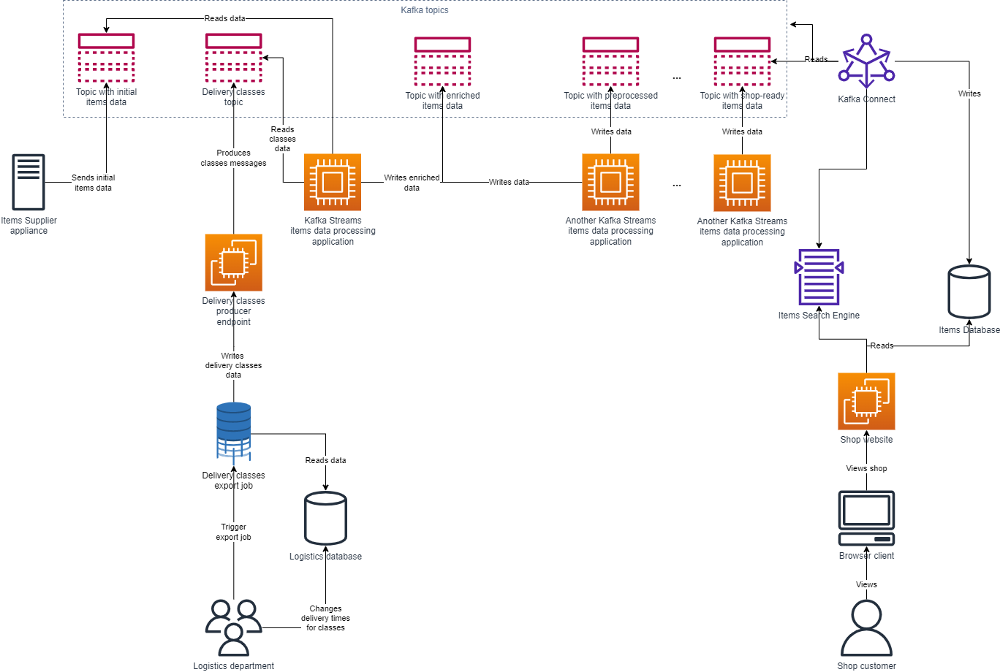

<!-- TOC -->
* [More than One Way to Update your Kafka-Backed Entity from another Data Source using Kafka Streams](#more-than-one-way-to-update-your-kafka-backed-entity-from-another-data-source-using-kafka-streams)
  * [Business Context, Requirements and Constraints](#business-context-requirements-and-constraints)
  * [Existing Setup](#existing-setup)
  * [Option 1: Write the Data to Kafka and Perform a Foreign-Key Join](#option-1--write-the-data-to-kafka-and-perform-a-foreign-key-join)
  * [Option 2: Use Kafka Streams and Update Commands to merge the datasources](#option-2--use-kafka-streams-and-update-commands-to-merge-the-datasources)
  * [Comparison and Final Thoughts](#comparison-and-final-thoughts)
<!-- TOC -->

# More than One Way to Update your Kafka-Backed Entity from another Data Source using Kafka Streams 

Data update processes can sometimes be complicated in event-driven ecosystems. 

In the most simple case, if you have a business entity which needs to be kept updated, and you have a process generating updates for this specific entity, it's of course more than straightforward.
Let's say we have Kafka as a backbone for our events' storage and an entity the state of which is tracked there (topic with messages - key is the entity unique identifier, value is its state). 
If we have a Kafka producer for this topic, the updates are easily implemented, as each new message is basically an update.

However, if the things are not that simple, and we have a separate datasource and separate processes which track some of the entity's attribute values, and we need to integrate this part of the system with our main Kafka system somehow, there are ways to do this, and you need to choose them wisely.

In this article we are going to review one real-world scenario when an existing Kafka ecosystem with Kafka Streams under the hood had to adopt a small business requirement resulting in a need to automate updates of an entity from a totally separate business process not related to Kafka at all.

## Business Context, Requirements and Constraints

We are dealing with an eCommerce platform, which sells items via online shop. 
But before the items information becomes available to the customers, this information needs some processing: ingestion from the suppliers' data stores, rules applying, categorization, data transformation etc. 
This is applied to lots of item attributes like tags, prices, stock information, description, size etc. 
Once it's done, the items become visible at the online shop website.

One of the attributes tells the estimate minimum and maximum time when the item could be delivered to the customer once ordered. 
We will call it "delivery time" from now on. 
Logistics department manually controls these delivery times by assigning minimum and maximum delivery time to each "delivery class" - and every item has a delivery class assigned.


They update delivery times via their own specific process they are used to, and the data is saved to their own separate datasource which has nothing to do with the overall existing items data processing and storage platform.
Once they change the time for a specific class, they expect every item which has this class assigned to eventually have the updated delivery time values, and these values should be visible in the item description page in the online shop.
There is no specific requirement on how quick the information must be updated in the online shop.

Items information is supposed to be visible not only in the online shop, but also at other different data integrations, like Google searches, partner shops etc. 
So it's not acceptable to assign updated delivery time values to the item at the very end stage of items information processing, when the item state lands to the shop datasource. 
This needs to be processed before the information gets distributed to other channels.

## Existing Setup

The shop uses Kafka as a backbone for processing items' state update events. 
The data is processed with applications using Kafka Streams library, and then stored in different data stores including ones exposed via API to the actual shop frontend. 
All data transformations, aggregations, manipulations are happening within Kafka topics, and delivery times are assigned to the items at early stages of items data aggregation into one data object - before items are classified into categories and distributed across the destinations where the items data is expected.

Delivery times assignment is performed by one of Kafka Streams applications which calculates all stock data. Initial items data is received from the supplier via a Kafka topic as an event identified by item SKU, which is sent by a producer related to the items' supplier.
Once the item data is received, besides all other stock data calculations, the application queries an AWS DynamoDB table which has delivery class -> minimum and maximum delivery time mappings.

Logistics department stores their class -> times mappings in an SQL RDBMS, and they can have a job which they schedule or launch manually to write this data from their tables to basically anywhere.

Below picture shows the concept view of the existing setup which is described above.


The problem of such an approach is that when the times for a class are changed, and even are propagated to DynamoDB table, it's challenging to update the times values of all items which have this delivery class assigned.
To do that, the item has to be updated via the supplier channel, so that the stream application could pick an event with its new state, go to DynamoDB to look up the times and assign them to the object, and then send the enriched object as a message further.
But what if the supplier doesn't need to update the whole item, and only Logistics department wants to update the delivery times for the item?
In that case someone needs to produce a "fake" update of the whole item through supplier channel to have the times updated. 
And one should not forget to roll back these updates by producing items with their original state through the same channel, so that only delivery times attributes would be updated.
And since there could be thousands of items having delivery class which is changed, one needs to retrieve all these item states from some datastore (and hope it's the latest one and no other updates are pending in the streams pipeline), prepare messages with fake updates and send them through the channel. 
This is a lot of manual work and operational overhead which can bring inconsistencies to the data. 

Business would like to automate the process and remove the overhead + maintain data consistency.
Let's review the possible ways how to solve this problem.

## Option 1: Write the Data to Kafka and Perform a Foreign-Key Join

If we try to consider delivery classes data including times as items related data and a separate business entity, it could be a part of our data processing ecosystem in the form of a separate Kafka topic and corresponding KTable, which then can be used in some business processes.

One of the most classical ways to change an entity's attribute within one topic in Kafka, taking the value from another one, is Kafka Streams Foreign Key Join.
The join happens between two KTables which represent messages aggregation from a given topic. And since Kafka Streams are capable to read streaming events of entity's state changes, we can use them to join two streams according to our business logic and produce the output as aggregated events to the downstream topic.

To implement this approach, we first need to deliver the data from DynamoDB to Kafka. Having our data sourced in DynamoDB, we could have leveraged DynamoDB Streams and, for example, a Lambda function to produce all inserts or updates to the Kafka topic.
But since we'll have our delivery classes information sourced both in Kafka, and in Logistics Department database, we might want to get rid of the additional data source business won't be using.

The algorithm to implement the approach will be the following:

1. Create a new Kafka topic for delivery classes. Choose the number of partitions and replication factor.
2. Create a Producer for the topic. It could be, for example, a REST endpoint which accepts a class as an entity.
3. Perform the initial load of delivery classes into Kafka. Since Logistics department already has a job to post delivery classes data from their database to any destination, we could change it to perform REST HTTP calls to our new endpoint to save classes data into our Kafka topic.
4. Change our items data processing stream topology to perform a Foreign Key Join between the table with items data from supplier and the table with delivery classes data. To do this, you need to implement a ValueJoiner and use it in the topology logic. Write the result to the downstream topic for further processing.

The code for ValueJoiner could look in the following way in Java:

```java
package de.soname.developer;

import de.soname.developer.schema.DeliveryClass;
import de.soname.developer.schema.Item;
import de.soname.developer.schema.ItemDeliveryClassMergedData;
import org.apache.kafka.streams.kstream.ValueJoiner;

public class ItemDeliveryClassJoiner implements ValueJoiner<Item, DeliveryClass, ItemDeliveryClassMergedData> {
    public ItemDeliveryClassMergedData apply(Item item, DeliveryClass deliveryClass) {
        return ItemDeliveryClassMergedData.newBuilder()
                .setId(item.getId())
                .setDescription(item.getDescription())
                .setMinimumDeliveryTime(deliveryClass.getMinimumTime())
                .setMaximumDeliveryTime(deliveryClass.getMaximumTime())
                .build();
    }
}
```

The code for the topology could look like this:

```java
package de.soname.developer;

import de.soname.developer.schema.DeliveryTimeClass;
import de.soname.developer.schema.DeliveryClassNameKey;
import de.soname.developer.schema.ItemData;
import de.soname.developer.schema.ItemDeliveryClassMergedData;
import de.soname.developer.schema.ItemKey;
import lombok.RequiredArgsConstructor;
import org.apache.kafka.streams.kstream.KStream;
import org.apache.kafka.streams.kstream.KTable;
import org.apache.kafka.streams.kstream.Materialized;
import org.apache.kafka.streams.kstream.Named;
import org.springframework.beans.factory.annotation.Autowired;
import org.springframework.context.annotation.Bean;
import org.springframework.context.annotation.Configuration;

import java.util.function.Function;

@Configuration
@RequiredArgsConstructor
public class ItemDeliveryClassTopology {
    
    private final ItemDeliveryClassJoiner itemDeliveryClassJoiner;

    @Bean
    public Function<KStream<ItemKey, ItemData>,
            Function<KTable<DeliveryClassNameKey, DeliveryTimeClass>,  
                    KStream<ItemKey, ItemDeliveryClassMergedData>>> itemDeliveryClassDataStream() {
        return itemStream -> deliveryClassTable -> 
                itemStream
                    .toTable(Named.as("itemTable"), Materialized.as("itemTableStore"))
                    .leftJoin(deliveryClassTable,
                            ItemDeliveryClassTopology::fkExtractor,
                            itemDeliveryClassJoiner,
                            Named.as("itemDeliveryClassMerged"))
                    .toStream();
    }

    private static DeliveryClassNameKey fkExtractor(ItemData itemData) {

        return DeliveryClassNameKey.newBuilder()
                .setDeliveryClassName(itemData.getDeliveryClassName())
                .build();
    }
}
```

The architecture of the target setup would look like this:



The solution has the following benefits:

1. This approach naturally uses Kafka and Kafka Streams which aligns conceptually with the overall approach of data processing in the system.
2. The process is automated and does not rely on synthetic updates. One job needs to be executed once the classes are ready to be posted. In another context, you can avoid using jobs and producers at all, and use other automated tools like Kafka Connect - this would work too, if you can afford connecting to the original datasource, and it won't bring tight coupling.
3. The approach is cost-effective since it does not need a DynamoDB table and frequent reads from it.
4. The new topic with classes can be easily used in any other processing logic done with Kafka Streams.

However, it also brings few challenges:

1. Foreign Key Join can sometimes be time-consuming operation. Especially when there is low cardinality between two tables. For this particular case, there could be millions of items, but there are only ~50 delivery classes. That could mean potential increased data processing time when a class is updated. And consequently it can impact the platform overall performance and become a bottleneck for the processing chain.
2. Foreign Key Join creates additional topics and KTables to perform the join - it needs memory to manage the state information about two tables. In that case the memory consumption of Kafka system can increase.
3. In even more complex cases (e.g. in our real case, we had an array of classes in every item, and we had to sort them by minimumTime and choose the most optimal one), the topology could become very complex, resulting in many joins groupings and aggregations, significantly impacting performance.

All in all, the approach works fine if the cardinality between two tables you have is high. It can be fully automated, it stays within the whole Kafka context and flexible enough for more integrations.
But let's look at another example of how could we complete the task if we have performance concerns.

## Option 2: Use Kafka Streams and Update Commands to merge the datasources

If we are concerned about the performance of Foreign Key Join when we have only few delivery classes to consider, we can try a bit more creative approach.

If we take a look at the existing setup of the system, we are already fine with updating items' delivery times when we have an update of an item coming from the supplier source.
The thing we're not capable of yet, is reacting on the update of delivery times in the updated class.
At the same time, our platform can know exactly when the class is updated, and can react on such events.
We can approach the requirement accomplishment by finding a way how to send signals to our platform to reprocess our items' information, so that the delivery times could be updated.
And we want to avoid Foreign Key Joins in our approach :)

We are going to use a regular primary key join by message key which is the fastest way to join the streams. In case when our items information have a itemId as a key, we need to have a topic with itemId as a message key as well, so that we could send events there when we want the stream to redo the work, look up DynamoDB table and update the values of delivery times. 
We'll call this new topic "replay" topic from now on - because we want to use this topic as a source for "replay" events for our items, so that they could go through stream processing logic one more time when we need them to.

The challenging part there would be to have these itemIds available to us, and to have a topic filled with such messages, once we want the times to be updated in our items information.
First of all, you need a source for the item ids. This could be a database, or some system you could integrate with to efficiently grab these ids and place them into the topic.

For our case, since we are a shop, we've got a search engine which is running on Apache Solr. We can query it for the item ids, or we can use a middleware access layer like API, if we have one, and we want to maintain low coupling in the system.

Once we have a storage with ids, we need a functional unit to grab them and produce them in the new topic on demand.
This could be a combination of a job and an application which could read the ids and post them to Kafka.

In short, the algorithm would look like that:

1. Create a new topic in Kafka with itemId as a message key. Choose the number of partitions and replication factor (it could be the same as you general items topic parameters).
2. Change your main topology so that it would not only read DynamoDB for classes data, but would also perform a primary key join of a stream with items' data with the stream of your new topic.
3. Implement a functional component which would read the itemIds, and post them into the new Kafka topic. Consider retry policies and failover mechanisms for it.
4. Add an interface to trigger the process of itemIds replay, and integrate with it in the classes exporting job.

To implement the overall topology with primary key join, one will need to define it in the way similar to the one shown below, written in Java using Spring:

```java
package de.soname.developer;

import de.soname.developer.schema.ItemData;
import de.soname.developer.schema.ItemDataMerged;
import de.soname.developer.schema.ItemDataReplay;
import de.soname.developer.schema.ItemKey;
import lombok.RequiredArgsConstructor;
import org.apache.kafka.streams.kstream.KStream;
import org.apache.kafka.streams.kstream.KTable;
import org.apache.kafka.streams.kstream.Named;
import org.springframework.beans.factory.annotation.Autowired;
import org.springframework.context.annotation.Bean;
import org.springframework.context.annotation.Configuration;

import java.util.function.Function;

@Configuration
@RequiredArgsConstructor
public class ItemReplayTopology {
    
  private final ItemDataToItemDataReplayJoiner itemDatatoItemDataReplayJoiner;
  
  @Bean
  public Function<KTable<ItemKey, ItemData>,
          Function<KTable<ItemKey, ItemDataReplay>,
                  KStream<ItemKey, ItemDataMerged>>> itemReplayStream() {
    return itemStream -> replayStream -> itemStream
            .leftJoin(replayStream, itemDatatoItemDataReplayJoiner, Named.as("itemDataReplayMerged"))
            .toStream();
  }

}
```

While the ValueJoiner could be written in any convenient way similar to the one from option 1: depending on the data which is needed or not needed from the Replay object.
For example in this joiner we need to inject the functionality for delivery classes lookup in DynamoDb and times assignment into ``ÌtemDataMerged``.

The approach would conceptually look like that:


The following optimizations should be considered if we choose this approach:

1. If there are millions of items, we need a paginated way to read the item ids to gradually consume the data and to replay it in Kafka.
2. The process shouldn't ideally be synchronous, as the replay process could take time and fail in the middle. Ideally one should split the ids in subsets (for example, using search engine pagination) and track the page number in a persistent storage, so that the process would know where it stopped if failed, so that it could retry again. Consequently, a retry policy should also be considered, e.g. on the initial command level, which could be sent as an event.
3. If you can filter the ids which you need, you should consider that. For example, for the shop only online items are relevant for delivery times updates. This is considered on search engine query level.

The approach has the following benefits:

1. Just like the first approach, the process does not rely on manual interventions, except for the job which needs to be executed to trigger the process.
2. The approach will be performance efficient for the items pipeline in general, because it uses an efficient streams join to process the data, and fast queries to DynamoDB which could be additionally cached if needed.
3. The approach implements few universal mechanisms for events replay, which can be used in other parts of the data pipeline if needed.
4. The approach works fast enough especially for low amount of delivery classes to merge with the items, if we have quick access to classes data.

However, it also brings some challenges:

1. You need access to the item ids, ideally cost-effective and performance efficient.
2. You need to implement a service which does the job of ids reading and replaying to Kafka - and make it reliable and fault-tolerant.
3. You still need to change your initial topology to do the join of your general items stream with the new topic.

## Comparison and Final Thoughts

Both approaches will work and accomplish the given requirements in this specific case.
However, one of them could bring performance degradation of the whole data processing chain, while another one is challenging to implement and could bring conceptual inconsistencies of the whole data processing platform.
You need to consider the following things when choosing between approaches:

1. Your data volumes.
2. Cardinality between both data sources you want to join.
3. Your context and capabilities of the platform you're working on.
4. Maturity of the team to implement both approaches, their priorities and capabilities.
5. Requirements on performance, reliability, conceptual integrity and cost-efficiency of the solution.

Overall, the most efficient approach will depend on the specific requirements and constraints of your system. 
It's always a good idea to benchmark and test different approaches to determine which one provides the best performance for your use case.
